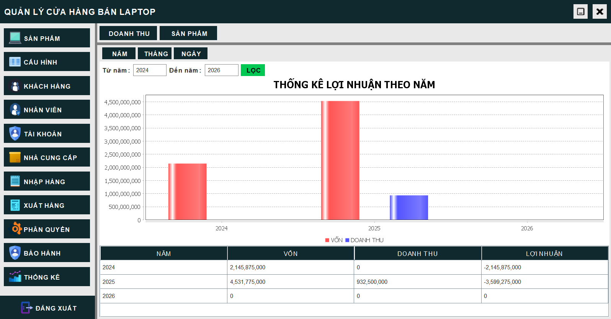

# ĐỒ ÁN MÔN PHÂN TÍCH THIẾT KẾ HỆ THỐNG THÔNG TIN
Đề tài: Quản lí cửa hàng bán laptoplaptop

## Cài đặt
1. Tải source code về:
   ```bash
   git clone https://github.com/mujin0422/JavaLaptopStoreApplication.git
   ```
2. Tạo cơ sở dữ liệu
Mở xampp và vào trang http://localhost/phpmyadmin/ tạo 1 database có tên là quanlibanlaptop.
Import cơ sở dữ liệu trong folder database -> quanlibanlaptop.sql.

3. Sử dụng netbeans để chạy source code.

## Các tính năng
- Quản lí phiên người dùng
- Quản lí sản phẩm
- Quản lí cấu hình sản phẩm
- Quản lí khách hàng
- Quản lí nhân viên  
- Quản lí tài khoản nhân viên
- Quản lí nhà cung cấp
- Quản lí nhập hàng
- Quản lí xuất hàng
- Quản lí phân quyền
- Quản lí bảo hành
- Quản lí thống kêkê

### Giao diện

 
 <h4 align="center">Đăng nhập</h4>
 


 <h4 align="center">Trang chủ</h4>
 


 <h4 align="center">Sản phẩm</h4>
 


 <h4 align="center">Cấu hình sản phẩm</h4>
 


 <h4 align="center">Khách hàng</h4>
 


 <h4 align="center">Nhân viên</h4>
 


 <h4 align="center">Tài khoản</h4>
 


 <h4 align="center">Nhà cung cấp</h4>
 


 <h4 align="center">Nhập hàng</h4>
 


 <h4 align="center">Xuất hàng</h4>
 


 <h4 align="center">Phân quyềnquyền</h4>


 <h4 align="center">Bảo hành</h4>
 


 <h4 align="center">Thống kê</h4>

